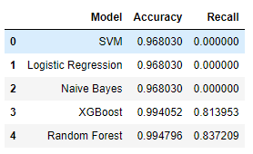
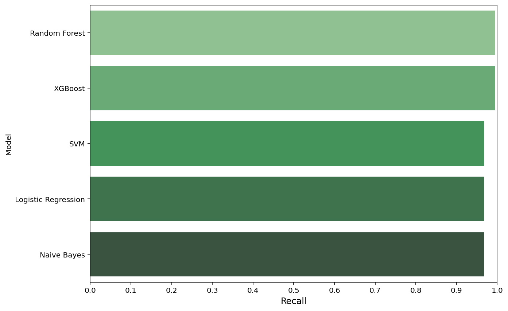
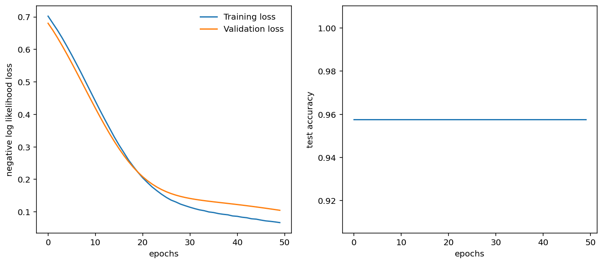

# Fake_Job_Postings_Detection
The project focuses on predicting if a job is fake or not using natural language processing techniques and data mining techniques.
# Problem Definition
* Companies looking for potential candidates by posting job vacancies.
* Since increase in the number of job postings, scammers have taken the change to make fake job advertisements
* This is why it is important to have a tool that identifies the fake job postings
# Dataset Description
The dataset is available in kaggle. To get the dataset [click here](https://www.kaggle.com/datasets/shivamb/real-or-fake-fake-jobposting-prediction)  
The dataset has numeric and textual features that include:
* `job_id`: a unique ID for each post 
* `title`: the job title 
* `location`: the location of the job 
* `department`: company department              
* `salary_range`: the expected salary range            
* `company_profile`: company description          
* `description`: the job description                 
* `requirements`: list of the job requirements             
* `benefits`: list of the offered benefits                  
* `telecommuting`: if the position is telecommuting           
* `has_company_logo`: if there is a company logo             
* `has_questions`: if there are screening questions               
* `employment_type`: the type of employment (full-time, part-time, contract, etc.)       
* `required_experience`: the level of experience required for the job (e.g. Internship, Mid-Senior level, Executive)      
* `required_education`: the degree required to work at the company (e.g. Bachelor's, Master's, Doctorate, etc.) 
* `industry`: the field of work (e.g. Automotive, IT, Health care, Real estate, etc.)                 
* `function`: the function of the job (e.g. Consulting, Engineering, Research, etc.)               
* `fraudulent`: whether the job posting is fraudulent or not 
# NLP Method Used
* TFid Vectorizer is used to convert text into vectors also priortizing the important features
* The testing and training texts are fit and vectors are determined 
# Best Machine Learning Model Used
  

# Deep Learning Model Used (Pytorch)
* After the text was converted to vectors, a simple Multilayer Preceptron model was used
* 50 epochs were used while training and testing the model  
Accuracy and Loss per epochs  

# Tools used
* Jupyter Notebook
* Orange Tool
* Notebook Markdown
* Python libraries (Scikit-learn, Seaborn, Matplotlib, Pandas, Numpy etc.)
* Pytorch
